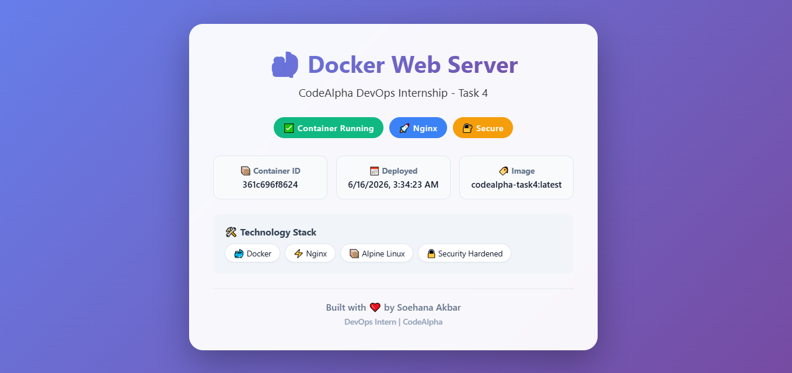
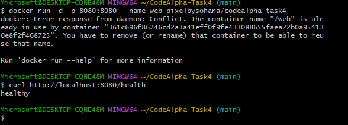
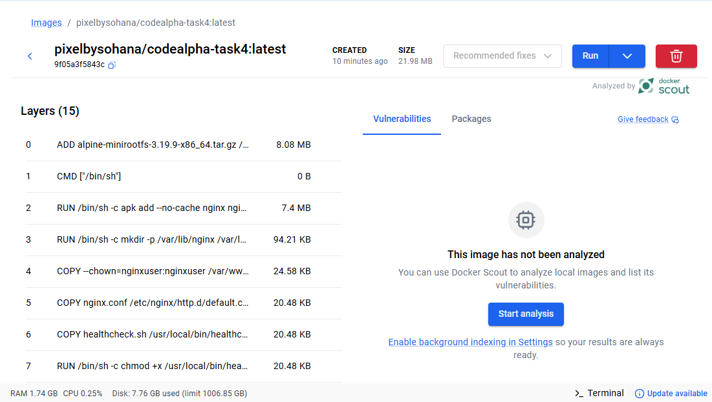
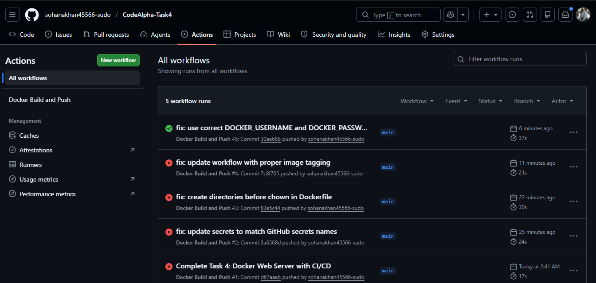
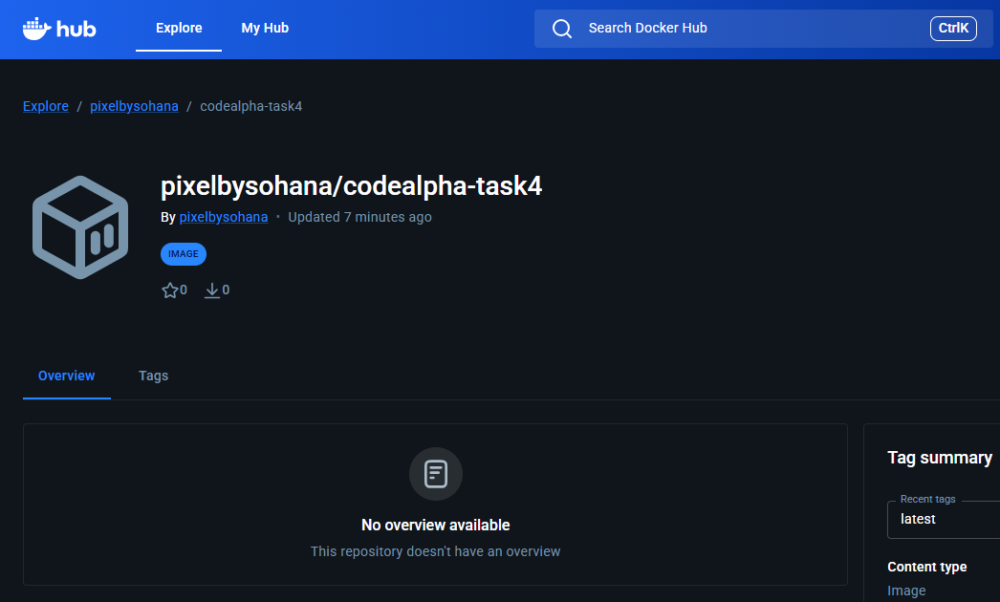

# 🐳 CodeAlpha DevOps Internship - Task 4

## Docker Containerization & Web Server Deployment


---

## 📋 Task Requirements

| Requirement | Status |
|-------------|--------|
| Docker containerization basics | ✅ |
| Web server in Docker container | ✅ |
| Container lifecycle management | ✅ |
| Health monitoring | ✅ |
| Troubleshooting | ✅ |
| Best practices | ✅ |

---

## 🚀 Quick Start

### Prerequisites
- Docker Desktop installed
- Docker Compose
- Git

### 1. Clone the Repository
```bash
git clone https://github.com/sohanakhan45566-sudo/CodeAlpha-Task4.git
cd CodeAlpha-Task4
2. Build and Run
bash
# Build the image
docker build -t codealpha-task4:latest .

# Run with Docker Compose
docker-compose up -d

# Check container status
docker-compose ps
3. Access the Web Server
text
http://localhost:8080
🛠️ Docker Commands
Container Management
bash
# Build image
docker build -t codealpha-task4 .

# Run container
docker run -d -p 8080:8080 --name web codealpha-task4

# View logs
docker logs web

# Stop container
docker stop web

# Remove container
docker rm web
Health Checks
bash
# Check health status
docker inspect web | grep -A 5 Health

# Test health endpoint
curl http://localhost:8080/health
📸 Screenshots
## 📸 Screenshots

### Web Server Running


### Health Check


### Docker Desktop


### CI/CD Pipeline Success


### Docker Hub Image


🔐 Security Best Practices
✅ Non-root user in container

✅ Alpine Linux minimal base image

✅ Security headers in nginx

✅ Health checks implemented

✅ Vulnerability scanning in CI/CD

👨‍💻 Author
Soehana Akbar - DevOps Intern, CodeAlpha

✅ Task 4 Complete
